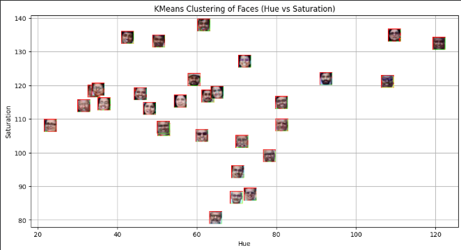
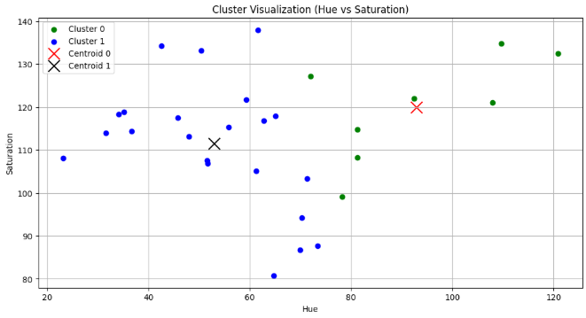
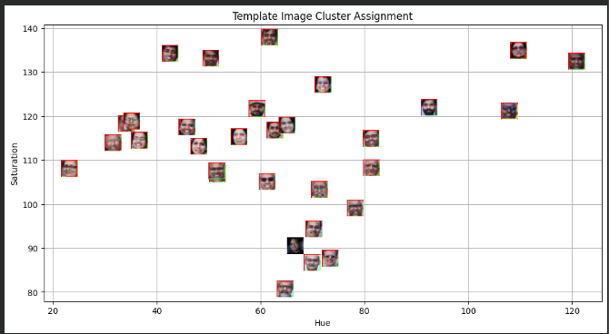
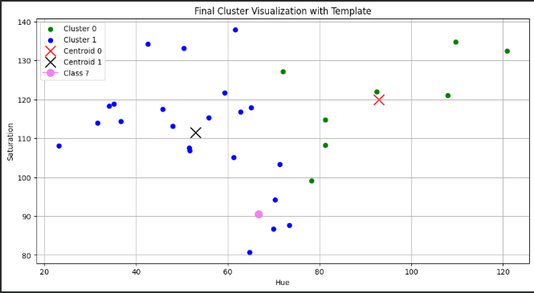

# Advika_lab5
# Lab 5 – Face Clustering using KMeans

# Aim
The aim of the lab is to identify the faces in the image and study the feasibility of using unsupervised learning techniques like KMeans for face clustering based on visual features like Hue and Saturation of the faces.

# Methodology

1. Face Detection: Faces were detected using the Haar Cascade Classifier. OpenCV was used for the same.

2. Feature Extraction: The image was transformed into the HSV colour space. The mean values of the Hue and Saturation features were calculated for the faces.

3. Clustering: The KMeans algorithm was used for face clustering.Faces were clustered based on the features like Hue and Saturation.

4. Template Classification: The values for the Hue and Saturation features were calculated for the template.The trained model was used for predicting the face cluster.

# Key Findings
Faces were successfully detected using the Haar Cascade Classifier. The features like Hue and Saturation were successful in face clustering. The faces were clustered using the unsupervised learning algorithm.The template was classified into the face cluster.

# Conclusion

This lab shows the effectiveness of KMeans clustering in arranging visual data without labelled examples. Colour-based features like Hue and Saturation provide good discriminative information when clustering faces with similar features. This experiment shows the real-world application of unsupervised learning in image processing.

# Visualisations
# Face Detection

# Initial Clustering Result

#Initial Clustering Graph

# Template Image Face Detection

# Final Clustering Result

# Final Clustering Graph

